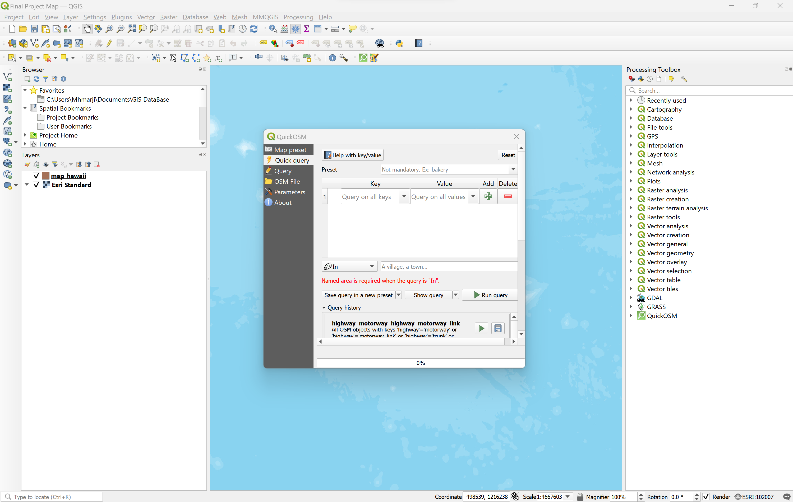
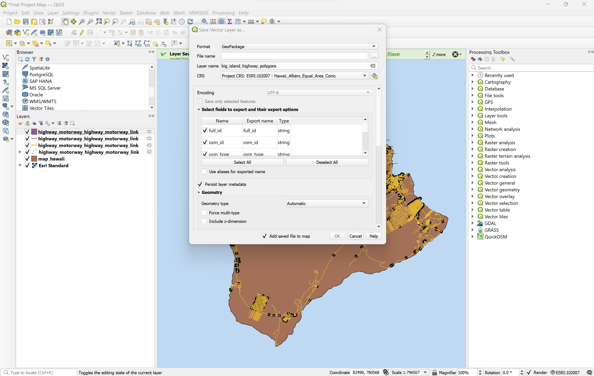

# Final-Project

This is my final project for MAP 671.

Project Title:

Collaborator: Instructor GitHub username jfobrycki

These are the instructions on how this map was created:

Change the assigned CRS Projection to ESRI:102007. 

Right click the cb_2022_us_state_500k source. Click on the filter section, and then select "Name". Click the equal sign, and then click on the sample button. Once done, select "Hawaii". It will produce something like "NAME" = "Hawaii".

Afterwards, use the QuickOSM to create features. To access the QuickOSM tool, click on the Vector section. After clicking on the QuickOSM tool, click on "quick query". After selecting the tools to generate, change it to "Canvas Extent". Then, click "Run Query" and it will then appear on the layers section and the map itself.

Export the layers when it is ready to do so. Save as GeoPackage, and change the CRS to ESRI:102007.

The source that is also used will be the Hawaii Geoportal. To access the link, click here: https://geoportal.hawaii.gov/
