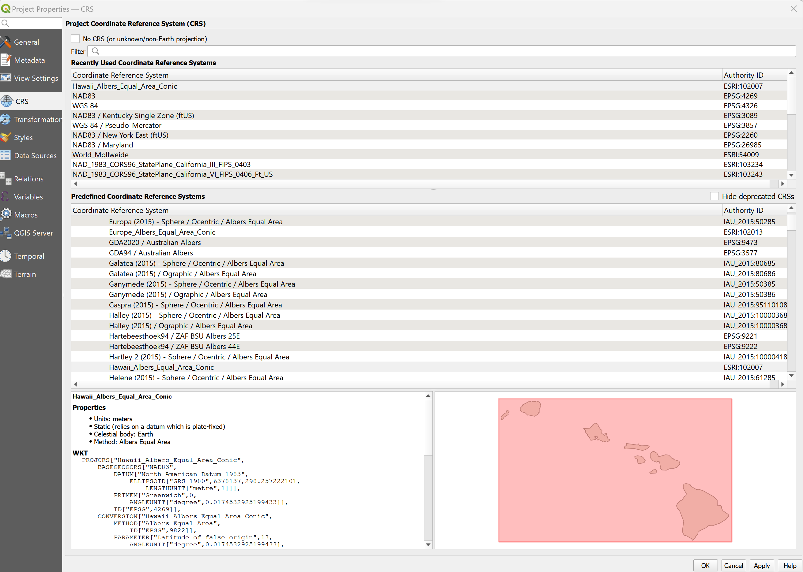
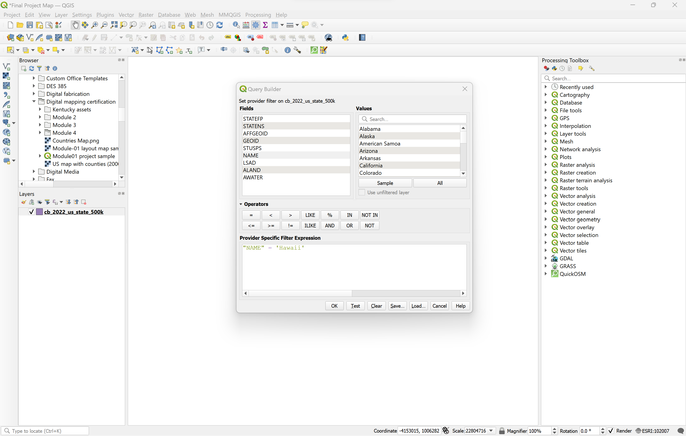

# Final-Project

This is my final project for MAP 671.

Project Title:

Collaborator: Instructor GitHub username jfobrycki

These are the instructions on how this map was created:

Change the assigned CRS Projection to ESRI:102007. 

Right click the cb_2022_us_state_500k source. Click on the filter section, and then select "Name". Click the equal sign, and then click on the sample button. Once done, select "Hawaii". It will produce something like "NAME" = "Hawaii".

The source that is also used will be the Hawaii Geoportal. To access the link, click here: https://geoportal.hawaii.gov/
