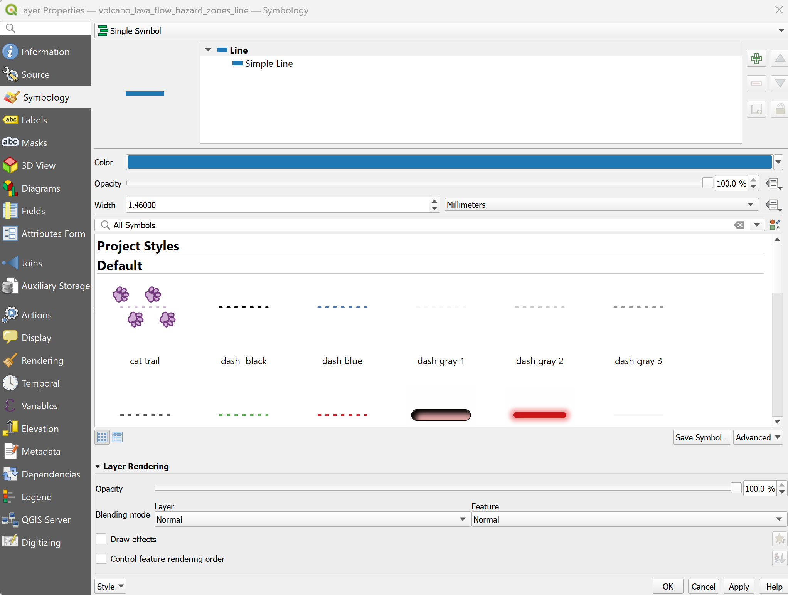

# Final-Project

This is my final project for MAP 671.

Project Title: Lava Flow Hazard Of Hawaii

# Purpose

The purpose of my project will be to create a final map that uses the map of Hawaii. The Big Island will be the main focus of this project. This map will focus on the volcano lava flow hazard locations which will involve the roads in the area. It would showcase which area has the most hazard and how it would affect the roads.

# How To Create The Map
These are the instructions on how this map was created:

Change the assigned CRS Projection to ESRI:102007. 

Right click the cb_2022_us_state_500k source. Click on the filter section, and then select "Name". Click the equal sign, and then click on the sample button. Once done, select "Hawaii". It will produce something like "NAME" = "Hawaii".

Afterwards, use the QuickOSM to create features. To access the QuickOSM tool, click on the Vector section. After clicking on the QuickOSM tool, click on "quick query".  In this case, "Highways/Streets" was used. After selecting the tools to generate, change it to "Canvas Extent". Then, click "Run Query" and it will then appear on the layers section and the map itself.

Export the layers when it is ready to do so. Save as GeoPackage, and change the CRS to ESRI:102007.

The source that is also used will be the Hawaii Geoportal. To access the link, click here: https://geoportal.hawaii.gov/

Let's say I want to find information about lava. Select hazards, and then download the maps, and select the following: 2020 Census Tracts, Volcano Lava Flow Hazard Zones (Buffer), Volcano Lava Flow Hazard Zones, and Volcano Lava Flow Hazard Zones (Line). Download as a GeoJSON file. You can click on this link to find the three maps in a easier fashion: https://geoportal.hawaii.gov/datasets/HiStateGIS::volcano-lava-flow-hazard-zones/explore

Now if I were to add police stations to the Big sland, I would need to select this file link: https://geoportal.hawaii.gov/datasets/police-stations-island-of-hawaii/explore

Next up, a joined layer will be created. To do that, select "Join attributes by layer (summary)". It will produce something like this (see above). Once clicked, it will produce something like this. In "join to features in", select the 2020_Census_Tracts file, which is a ESRI:102007 projection. In "by comparing to", select the volcano_lava_flow_hazard_zones file, which is also a ESRI:102007 projection. The joined layer will be saved as a "geopackage", and then, click run.

On the joined layer, select Properties. Go to the Symbology section and add vhzones_id to the value section. Then, change the feature to "Addition". Change the classes number to 18. After that, select the color ramp and enter whichever gradient color works. The mode is on Equal Count (Quantile). Then, when ready, click "classify". It should give a gradient color pattern.

# Creating the map layout

To create a map layout, click on New Print Layout. The layout could be titled as something like Final Project Map Layout. The initial layout will look something like this above.

Rename "volcano_lava_flow_hazard_zones" to "Hazard Zone Boundary" but the best thing to do is to make the line more bigger. Change the width to something bigger like "1.46000" or whichever works best.

On the legend file, try renaming other stuff as well. Rename "Police_Stations_-_Island_of_Hawaii" to "Police Stations" and "big_island_highway_lines" to "Highways". Also, rename the joined layer to something like "Hazard Zone".

For the "Hazard Zone", which was previously the joined layer, also change the numbers to it's vhzones_id numbers.

Also, remove the census (also called the 2020_Census_Tracts), volcano_lava_flow_hazard_zones, buffer zone, big_island_highway_polygons ("General Built Environment") and map_hawaii as these layers are no longer needed for the map layout. 

# Sources
Below is a list of sources that I have used for this project.
* https://geoportal.hawaii.gov/ (Source used to download the lava hazard flow, census tract, and police stations)
* QuickOSM (the source I used to add the roads)

Those three sources below are very similar to how the map was done and it provides information related to the lava flow hazard.
* https://pubs.usgs.gov/mf/1992/2193/mf2193.pdf
* https://pubs.usgs.gov/mf/1992/2193/
* https://www.usgs.gov/observatories/hawaiian-volcano-observatory/lava-flow-hazards-zones-and-flow-forecast-methods-island

# Final Map

This is what my final map looks like.

To see the map as a link, [click here](http://127.0.0.1:5500/index.html)

# Conclusion
Based on my map, the area in Big Island that has the most lava flow hazard is in the Kau district. The Kau district is where the Hawaiʻi Volcanoes National Park is located, making lava flow hazards way more common in this area. Zone 1 (which has a vhzones_id of 10) is located in the district, which is where lava activity is more common. The area with the least amount of lava flow hazard is the Kohala district (North and South Kohala), which is the area where Zone 9 is located. The closest police stations to the areas and zones affected by lava flows the most are the Naalehu Station and Pahoa Station.